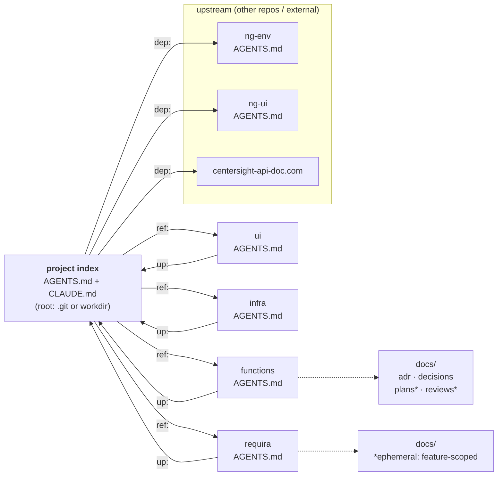

# The Agent Docs Standard (ADS)

A documentation standard for **AI-first software engineering projects** — designed so that
AI agents working inside a codebase can **find the information they need, where and when they
need it**, without loading the whole project into context.

ADS is **a profile of [AGENTS.md](https://agents.md)** — the cross-tool agent context
convention governed by the Linux Foundation's Agentic AI Foundation. It does not compete with
AGENTS.md; it builds on it, standardizing what AGENTS.md leaves open: how context files link
into a navigable graph, where deeper documentation lives, and how working documents are kept
from rotting. Every ADS-conformant project is a valid AGENTS.md project.

This repository contains two things:

| Directory | What it is |
|-----------|------------|
| [`standard/`](./standard/) | The formal standard: the vision, the normative spec, and templates. |
| [`example/`](./example/) | A worked example — a fictional AI-first project (*CenterSight*) that conforms to the standard. |

## The one-paragraph pitch

Every unit of a project — the repository root, and each module inside it — carries a
context file (`AGENTS.md`, with a `CLAUDE.md` alias). Those files are wired together into a
**typed, directed graph** using three pointer kinds: `up:` (parent), `ref:` (children /
related peers), and `dep:` (upstream dependencies, possibly in other repos). An agent that
lands anywhere in the tree finds the nearest context file, then **traverses the graph on
demand** to pull exactly the context a task requires. Durable knowledge (ADRs, decisions)
lives separately from ephemeral working docs (plans, reviews) so the record stays clean and
the working set stays small.

## Why this exists

Agents don't have a mental model of your repo. They have a context window and a filesystem.
The failure modes are predictable:

- **Context starvation** — the agent can't find the convention / constraint / prior decision,
  so it guesses or reinvents.
- **Context flooding** — someone pastes the whole repo (or a giant `CLAUDE.md`) into the
  window "to be safe," burning budget and burying the signal.
- **Stale-by-design docs** — a single monolithic doc that nobody can keep current.

ADS attacks all three with **locality** (context sits next to what it describes),
**progressive disclosure** (small entry points + explicit pointers), and a **clean
durable/ephemeral split** (so the permanent record is small and trustworthy).

## The model at a glance



Each node's `docs/` folder holds the same taxonomy: **durable** (`adr/`, `decisions/`, …)
and **ephemeral** (`plans/`, `reviews/` — garbage-collected per feature).

## Tooling

| Tool | What it does |
|------|--------------|
| [`standard/tools/ads-lint.py`](./standard/tools/ads-lint.py) | Zero-dependency conformance linter. Validates the frontmatter, the `up`/`ref`/`dep` graph, alias symlinks, and the docs lifecycle; reports the achieved conformance level. Wire it into CI. See [tools/README](./standard/tools/README.md). |
| [`standard/skills/adopt-ads/`](./standard/skills/adopt-ads/) | A Claude Code skill that sets up (or retrofits) the standard in any repo — detects greenfield/brownfield + topology, discovers modules, interrogates you for `dep:` pointers, scaffolds the files, and verifies with the linter. Install by symlinking it into `~/.claude/skills/`. |

```bash
# lint any project:
python3 standard/tools/ads-lint.py --root <project>
# adopt the standard in a repo (from Claude Code):
/adopt-ads
```

## Start here

1. Read [`standard/README.md`](./standard/README.md) — the vision and design principles.
2. Read [`standard/SPEC.md`](./standard/SPEC.md) — the normative specification.
3. Browse [`example/`](./example/) — start at [`example/AGENTS.md`](./example/AGENTS.md) and
   navigate the way an agent would: follow `ref:` down, `up:` back, `dep:` outward.
4. Copy from [`standard/templates/`](./standard/templates/) to adopt it in your own repo.
