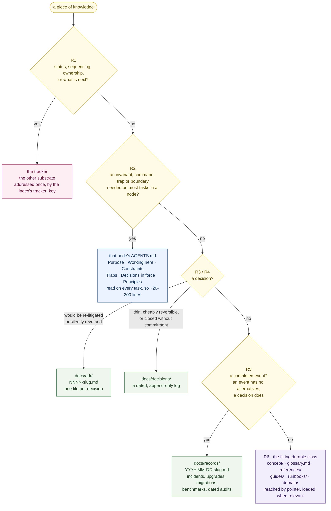

# The Agent Docs Standard - Vision & Design

> The normative rules live in [`SPEC.md`](./SPEC.md). This document explains the *why* - the
> design principles the spec encodes. Read this to understand the standard; read the spec to
> implement it.

## The problem, precisely

An AI agent operating in a repository is not like a new engineer who can absorb the codebase
over weeks. On every task it starts cold, with:

1. a **finite context window** (a hard budget - every token spent on irrelevant context is a
   token not spent on the task), and
2. a **filesystem** it can read on demand.

So the entire game is: *get the right context into the window at the right moment, and nothing
else.* A documentation layout is good for agents exactly to the degree that it makes this
easy. ADS is a set of conventions optimized for that single objective.

## Five design principles

### 1. Locality of reference

Context lives **next to the thing it describes**. The rules for the `ui` module are in
`ui/AGENTS.md` and `ui/docs/`, not in a central wiki. An agent editing a file in `ui/` finds
its governing context by looking *up from where it already is*, not by knowing where a central
doc store lives. This mirrors how code locality works and makes the "nearest context" cheap to
find.

### 2. Progressive disclosure over exhaustive dumps

A context file is an **entry point and a router**, not an encyclopedia. It states what the unit
is, how to work in it, and - crucially - *where to go for more*. An agent reads a small file,
then follows pointers to pull deeper context only when the task demands it. The alternative (a
giant `CLAUDE.md` that tries to say everything) fails twice: it's too big to keep in context,
and too big to keep current.

### 3. Typed navigation

Links between context files carry **meaning**, so an agent follows them *purposefully*:

- **`up:`** answers *"what's the broader picture / the project-wide rule?"* - traverse it to
  reach global conventions and the module map.
- **`ref:`** answers *"where's the related area?"* - the index's `ref:` is the module map;
  a module's `ref:` names siblings it's coupled to.
- **`dep:`** answers *"what do I build on that I don't own?"* - upstream repos and external
  docs, which may live entirely outside this repository.

Because the edge is typed, the agent knows *why* it's following a link and *what shape* of
information waits on the other side. This is the difference between a graph an agent can plan
over and a pile of undifferentiated hyperlinks.

### 4. Docs describe, issues track

A project keeps knowledge in two substrates, and the boundary between them is load-bearing:

- The **repository** holds durable knowledge - the answer to *"why is it like this?"* Small,
  curated, long-lived.
- The **tracker** holds work - the answer to *"what are we doing?"* Status, sequencing,
  ownership, what is next. None of it belongs in `docs/` or in a context file.

The reason is not tidiness, it is **invalidation**. A tracker item is invalidated by work
happening, and the tracker is the thing that observes work happening. A document has no such
observer, so a document that states status has no invalidation event its reader can see: it
rots silently and nothing detects it. That is the most common form of documentation rot there
is, and no lifecycle bolted onto the document fixes it.

What still has to happen when work lands is **distillation**: the constraint learned, the
interface fixed, the decision taken get written into the right durable class. The work's
*state* stays where it was.

### The taxonomy, and how content reaches it

Every piece of knowledge has exactly one home. These are the routing rules of `SPEC.md` §7.4
as a decision you walk top to bottom, first match wins. The spec is normative; this is the
same thing, drawn.

Two properties of that picture carry most of the weight.

**The substrate boundary is crossed once.** Only R1 leaves the repository, and the tracker is
named a single time, by the project index's `tracker:` key. No individual document links a
tracker item: a durable document outlives the work that produced it, so such a link resolves
long after it stopped being the reason.

**Time semantics follow mutability, not class-by-class taste.** Every destination in `docs/`
is one of two kinds, and its class decides which:

| | Classes | Rule |
|---|---|---|
| **Immutable and dated** | `adr/`, `decisions/`, `records/` | Written once, never edited. Dated by design, so time-connotated prose is admissible and expected: the reader can date every claim. |
| **Mutable and time-neutral** | `concept/`, `glossary.md`, `references/`, `guides/`, `runbooks/`, `domain/`, and any class a project adds | Edited in place, so they describe only what is true now. §4.7 applies: no "recently", no "no longer", no narration of change. Their history is their diff. |

A project adding a class **must** declare which side it falls on. That single question settles
the class's naming, whether it may narrate history, and what invalidates it.

### 5. Topology- and tool-agnostic

- **Repo topology:** the same node structure works for a **monorepo** (root anchored at
  `.git`, modules are subdirectories) and a **polyrepo** (root is a local workdir, modules are
  separate repos, `dep:` pointers become git URLs). The pointer graph spans repo boundaries by
  design - that's what `dep:` is for.
- **Agent tool:** `AGENTS.md` is the canonical file - ADS is a *profile* of the
  [AGENTS.md](https://agents.md) convention (governed by the Linux Foundation's Agentic AI
  Foundation), adding only what it deliberately leaves unspecified. `CLAUDE.md` is an alias
  (a symlink) so Claude Code and other tools each find a file under the name they look for,
  with **one source of truth** behind both.

## Why a *graph*, and not a tree

A tree (index → modules) captures ownership, but real dependencies aren't a tree:

- `ui` depends on the shared `ng-ui` component library (another repo).
- `functions` calls an external API documented at `centersight-api-doc.com`.
- `requira` is coupled to `functions` as a sibling.

`up:`/`ref:` give you the ownership tree; `dep:` adds the **cross-cutting edges** that turn it
into the graph that actually describes the system. An agent asked *"is it safe to change this
API call?"* follows `dep:` to the upstream doc - a question a pure tree can't answer.

## What an agent actually does with this

The payoff is a small, repeatable **navigation protocol** (specified in `SPEC.md §8`). A few
examples:

| The agent needs… | It does… |
|---|---|
| project-wide build/test commands & conventions | follow `up:` to the project index; read it |
| to safely change module *X* | from the index, follow `ref:` → *X*'s `AGENTS.md`; read `X/docs/adr/` for constraints |
| to understand an upstream dependency | read `dep:`; follow the pointer to the repo's `AGENTS.md` or the external doc URL |
| to know *why* something is built this way | read the nearest `docs/adr/` and `docs/decisions/` |
| to know what a domain term means | read `docs/glossary.md` beside the project index; use its term, and no synonym on its avoid-list |
| to know what happened during an upgrade or incident | read the dated files in `docs/records/` |
| to know the state of feature *F* | ask the tracker; it is not in the repository |

The agent never has to *guess* where information lives, and never has to load more than the
current hop of the graph.

## Non-goals

- **Not a replacement for good code.** Self-documenting code and types come first; ADS
  documents the *why* and the *where*, not the *what* that code already states.
- **Not a heavy process.** The minimum conformant project is one `AGENTS.md` at the root.
  Everything else is added when a unit is big enough to earn it.
- **Not tied to one vendor.** `CLAUDE.md` is an alias, not the canonical name; the standard
  works with any agent that reads a Markdown context file.

## Tooling

The standard ships with two tools so conformance is enforceable, not aspirational:

- **[`tools/ads-lint.py`](./tools/ads-lint.py)** - a zero-dependency linter that checks a project
  against `SPEC.md` and reports its conformance level (§9). See [`tools/README.md`](./tools/README.md).
- **[`skills/adopt-ads/`](./skills/adopt-ads/)** - a Claude Code skill that adopts/retrofits the
  standard in a repository, interrogating for dependency pointers and verifying with the linter.

## Next

Continue to [`SPEC.md`](./SPEC.md) for the normative rules, or explore
[`../example/`](../example/) to see it in practice.
